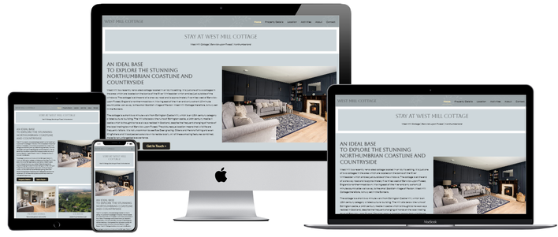
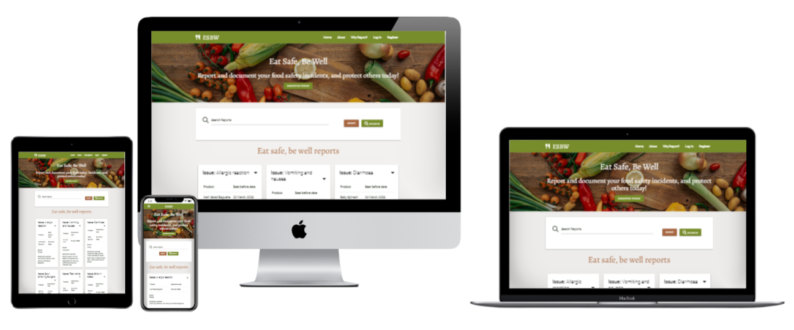
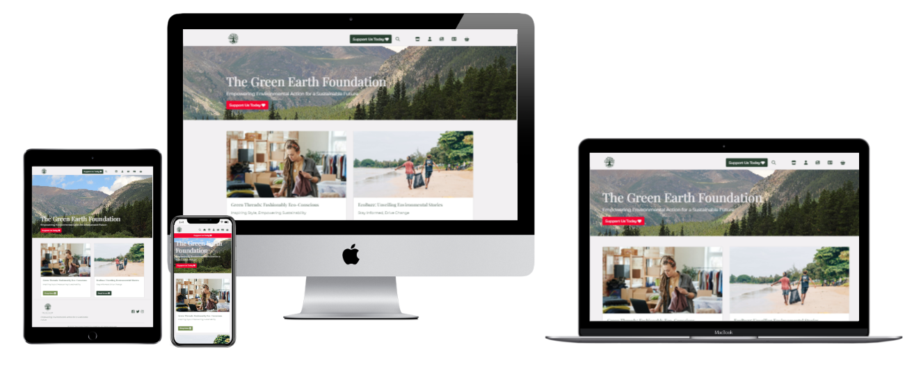

# PAUL TROTTER
## Aspiring Software Developer

- - - 

Hey, 👋 I'm Paul,

I have completed 4 out 4 of my milestone projects towards my Diploma in Web Application Development and I am awaiting my overall grade. I've always had an obsession with all things tech and I am pursuing this new knowledge as a way to keep continually improving...

When I am not coding, you'll find me keeping fit by working out, walking or playing football with my son. I also have a passion for food and the food industry having been involved with food safety and quality management for almost 14 years and I see so many opportunities for technology to assist and improve the food safety and quality functions within the food industry.

- - -

### Contact Me

- - -

### My Tech Stack

#### 👩🏻‍🏫 I'm Currently Learning

#### 🎨 Designs & Wireframes

#### < > Programming Languages

#### 📚 Libraries & Frameworks

#### 🗃 Databases

 

#### 🏡 Hosting

<!--- #### 🧪 Testing

 -->

#### 💻 Version Control, IDE's & Other Coding Content 

**Setup:** 

#### 🔮 Personal Future Learning Plans

- - - 

### Milestone Projects for Code Institute Diploma in Web Application Development

**Overall Diploma Grade:** [Distinction]()

Click here to view a summary of my Milestone Projects

| Milestone No.   | Project | Description | Grade | 
| :----------- | :----------- | :----------- | :----------- |
| 1 | 

<strong>West Mill Cottage</strong>
 | 
A website created for a holiday cottage using HTML, CSS, the Bootstrap Framework and deployed using GitHub pages.
 | Distinction |
| 2 | 

<strong>Like a Local</strong>
 | 
A website created for a London based travel guide business that contains access to Google Maps API and a quiz to test your knowledge of London. Created with HTML, CSS, JavaScript, jQuery and deployed using GitHub pages
 | Distinction |
| 3 | 

<strong>Eat Safe Be Well</strong>
 | 
A website created to document consumers food safety and quality incidents to protect others. Created with HTML, CSS, JavaScript, Python and Flask. This site uses a non-relational DB (MongoDB) and is deployed using Heroku.
 | Distinction |
| 4 | 

<strong>The Green Earth Foundation</strong>
 | 
A purpose-driven application dedicated to environmental conservation and sustainability built using Django full-stack framework.
 | Distinction |

- - -

### Stats
  
  

- - - 

### A little more insight

  

